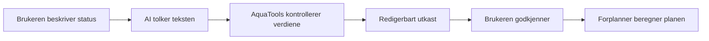

# Addendum: Forplanner

_Merk (2026-09-07): brief.md ble oppdatert til at appen bygges 100 % fra bunnen, ikke som videreutvikling av privat kode. Materialet under er likevel fortsatt relevant — som inspirasjonsgrunnlag for domenemodellen og som referansepunkt for med/uten-BMAD-sammenligningen i refleksjonsrapporten, ikke som kodegrunnlag._

## KI-funksjon «Beskriv status» — full arkitektur (utviklet av Odin med Codex, 2026-09-07)

**Flyt:**

**Fire deler:**
- **Fast dataformat:** en tydelig liste over hva KI-en får lov til å foreslå — silo, beholdning, kapasitet, fôrtype, merd, dagsforbruk, levering. Ingenting utenfor denne listen kan KI-en påvirke.
- **AI-tilkobling:** en liten, separat tjeneste som sender teksten til modellen — byttbar uten å endre resten av Forplanner (lokal Qwen på PC → ekstern GPU-server → kommersiell AI-tjeneste, i den rekkefølgen de trolig vil bevege seg).
- **Kontroll:** AquaTools/Forplanner avviser ugyldige datoer, negative mengder, beholdning over kapasitet, og referanser til siloer som ikke finnes — uavhengig av hva KI-en foreslo.
- **Godkjenningsvisning:** brukeren ser nøyaktig hva som skal legges til eller endres før noe lagres.

**Eksempel på utkast-visning:**

> **Fant i teksten:** 3 siloer · 3 merder · fôrtype 2500 · neste levering 09.09.2026
> **Må avklares:** Hvilken dato gjelder beholdningen? Er dagens fôring allerede gjennomført?
> **Foreslåtte endringer:** Silo 1: 15 043 kg · 5 435 kg/dag — Silo 2: 25 000 kg · 4 659 kg/dag — Silo 3: 19 200 kg · 5 643 kg/dag
> [Rediger] [Legg inn]

**Prototyp-status:** en nedlastet Qwen-modell kjørt lokalt gjennom en lokal kjøremotor tolket to testeksempler korrekt på henholdsvis 8,1 og 1,8 sekunder. Ikke ment som endelig produksjonsløsning — kun bevis på at tolkningen fungerer før AI-tilkoblingen eventuelt byttes til noe kraftigere.

**Testeksempel til bruk i automatiserte tester:** «Vi har tre siloer med 15 043, 25 000 og 19 200 kg. De tilhørende merdene bruker 5 435, 4 659 og 5 643 kg per dag. Alle bruker fôrtype 2500. Neste fôrbåt kommer 9. september og deretter ukentlig.» — riktig tolkning gir 3 siloer, 3 merder, fôrtype 2500, levering 09.09.2026, ukentlig gjentakelse, og et avklaringsspørsmål om beholdningsdato/dagens fôringsstatus siden teksten ikke sier dette eksplisitt.

## Kilde

Grunnlaget for denne brief'en er en teknisk kandidatvurdering utført av Codex (2026-09-07), basert på direkte besøk i AquaTools' grensesnitt — ingen kildekode eller beregningsmotor er gjennomgått, og eksisterende testdekning er ukjent. Full vurdering: [research.md](../../research/technical-aquatools-ibe160-2026-09-07/research.md). Observasjonsnotat: [digests/ui-r1-1.md](../../research/technical-aquatools-ibe160-2026-09-07/digests/ui-r1-1.md).

## Referansescenario for testing (konstruert, ikke observert driftsdata)

10 000 kg på lager, 2 000 kg daglig forbruk, en levering på 5 000 kg. Testen må gjøre eksplisitt om leveringen skjer før eller etter dagens fôring. Kan utvides med to siloer, ulik kapasitet og forskjellig fôrtype.

## Sammenligning med andre AquaTools-verktøy (alternativer, ikke valgt)

Alle sju verktøy ble besøkt gjennom nettgrensesnittet 2026-09-07. Kvalitativ faglig vurdering, ikke en objektiv rangering — ingen kandidat er vurdert mot bekreftede regler for gjenbruk av tidligere kode.

| Kandidat | Observert grunnlag | Vurdering som prosjekt |
| --- | --- | --- |
| **Forplanner** | Sammenhengende plan med lager, forbruk og leveringer | Valgt som førstekandidat i denne brief'en: tydelig problem, mange testbare regler. |
| Lokalitetspanel | Kart, ukedata, sortering, rapporteringsdekning | Nærmeste alternativ hvis begge foretrekker data/visualisering fremfor beregningsregler. |
| Døgngrader | Flere temperaturkilder, filimport, kalender | Mulig mer avgrenset alternativ — datakvalitet og sporbare beregninger. |
| Fôrkalkulatoren | Forbruksgrunnlag, import, avrundet bestilling | Mulig mindre prosjekt eller datainngang til Forplanner — mye finnes allerede. |
| Dødelighetsforløp | Observasjoner, tidsfordeling, estimatmerking | Interessant metodeprosjekt, men vanskeligere å validere et ukjent faktisk forløp. |
| Slangetrykk | Hurtigberegning, organisering av fôringslinjer | Smalest ut fra besøkt hovedflate. |
| Stingray Status | Innloggingskrav, inngang til eksportfilanalyse | Ikke undersøkt bak innlogging — uavklart omfang, ikke anbefalt foran Forplanner. |

## Kilder og tillit

Alle kilder er AquaTools' egne, direkte observerte sider (2026-09-07). Publiseringsdato ukjent for alle. Tillit vurdert som middels — grensesnittet viser funksjonalitet, men virkemåten er ikke uavhengig verifisert.

| Ref | Kilde | Tillit |
| --- | --- | --- |
| [1] | [AquaTools – Forplanner](https://aquatools.vercel.app/forplanner) | Middels |
| [2] | [AquaTools – Lokalitetspanel](https://aquatools.vercel.app/lokalitetspanel) | Middels |
| [3] | [AquaTools – Døgngrader](https://aquatools.vercel.app/dogngrader) | Middels |
| [4] | [AquaTools – Fôrkalkulatoren](https://aquatools.vercel.app/kalkis2) | Middels |
| [5] | [AquaTools – Dødelighetsforløp](https://aquatools.vercel.app/dodfiskfordeler) | Middels |
| [6] | [AquaTools – Slangetrykk](https://aquatools.vercel.app/slangetrykk) | Middels |
| [7] | [AquaTools – Stingray Status](https://aquatools.vercel.app/stingray-status) | Middels |

## Forslag til arbeidsdeling — ikke avtalt

Fôrplanlegging kan forklares som lager og etterspørsel over tid. En mulig arbeidsdeling er beregningsregler og referanseberegninger på den ene siden, og import, brukerflyt og lagring på den andre. Begge gjennomgår kjerneproblemet, tester og kode sammen. Oppgavene er ikke tildelt; gruppen avtaler fordelingen ved et eventuelt prosjektvalg.

## Beslutningsgrunnlag foreslått av Codex, fortsatt relevant

Dokumenter dagens kodeversjon og funksjoner. La begge gruppemedlemmer forklare ett eksempel med beholdning, daglig forbruk og forsinket levering. Beskriv deretter ett konkret problem dagens løsning ikke løser godt nok, og hvordan en test eller brukertest skal vise forbedringen. Dette gir et mer nyttig grunnlag enn å utvide til flere AquaTools-verktøy for å øke omfanget.

## Når vurderingen må oppdateres

Publiseringsdatoer for kildene er ukjente, så datobasert foreldelse kan ikke beregnes pålitelig — sjekk funksjonsomfanget mot konkret kodeversjon før prosjektvalg, uavhengig av alder på denne vurderingen.
